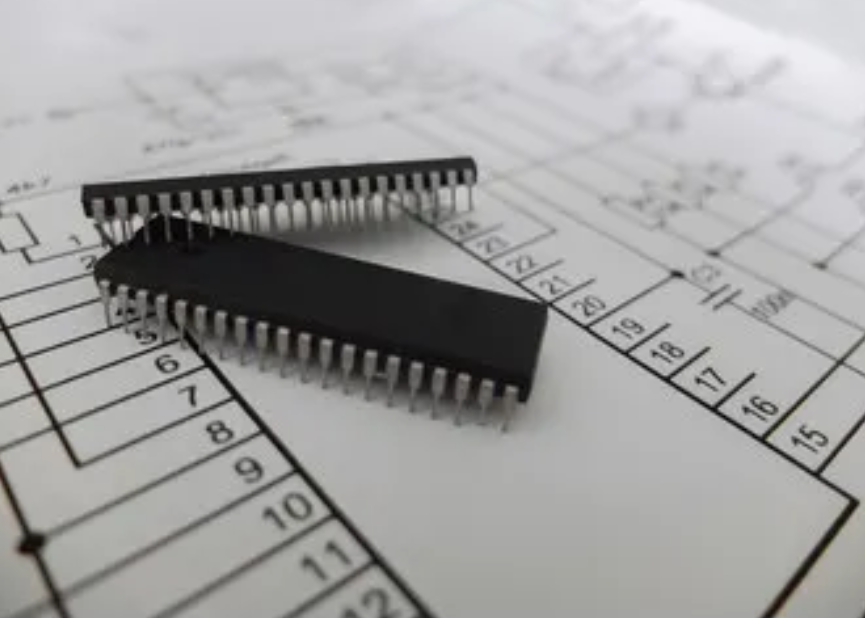
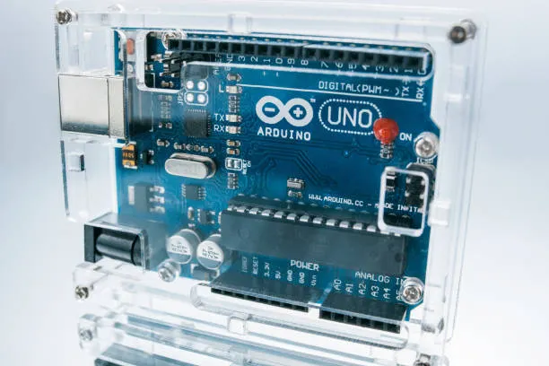
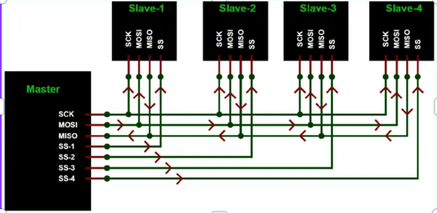
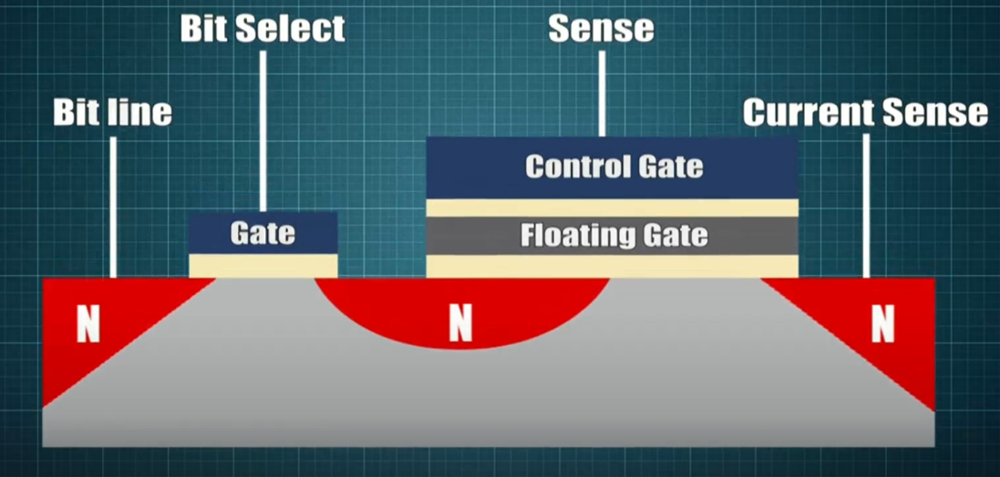
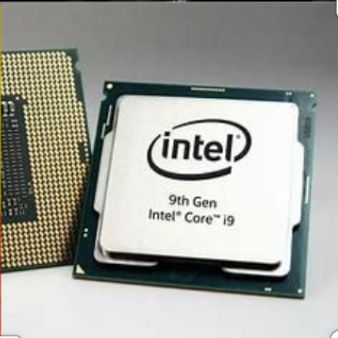

# MicrocontrollersAndMore

## 1. 🔌 Microcontrollers — Where Code Meets Circuit
A microcontroller is like a tiny self-contained computer that lives inside a single chip. It has its own processor (to do the thinking), memory (to store data and programs), and input/output pins (to interact with the outside world). You can program it to respond to sensors, control motors, blink LEDs, take decisions — basically automate anything you want.

What makes microcontrollers so powerful is that they can handle both logic and control in real-time, without needing a full-sized computer. They're the reason your microwave knows when to stop, your washing machine runs different cycles, and your car adjusts speed based on sensors. Once you understand how to work with one, you unlock the ability to build some really smart and interactive hardware.

This is where electronics stops being just circuits and starts becoming actual systems that do things.

**So what does a microcontroller actually consist of? You can break it down into three main parts:**

- The CPU – This is the core of the microcontroller. It handles all the processing, logic, and control. Think of it as the boss — everything else listens to it. It executes instructions, makes decisions, and keeps everything running.

- Memory – Just like us, microcontrollers need memory to remember things. Some of it (like Flash) is used to store the program permanently, some (like RAM) is used while the program is running, and sometimes you also get EEPROM for saving small bits of data that should stay even after a reset.

- Peripherals – Now, what’s the use of a brain if it can’t sense or act on the world? That’s where peripherals come in. They’re the built-in tools that help the microcontroller do stuff. Reading sensors, controlling LEDs or motors, communicating with other devices (like a PC or another MCU), keeping track of time, or even converting analog voltages — all that is handled by peripherals.

Okay okay — but this feels pretty far off from those simple circuits we’ve been building so far. So how does a microcontroller actually work?

What’s really happening under the hood?
How does the CPU know what to do and how to do it?

Well, here’s a quick explanation.

At the most basic level, all a microcontroller does is move values between registers, do some simple operations — like addition, comparison, or logic — and then load the results into other registers. Based on the values in these registers, it decides how to control its peripherals.

And how does it know what operations to perform?
That’s where your code comes in. All the instructions you write are compiled into machine code — the lowest level of code that a microcontroller can understand. This code is stored inside the microcontroller's memory. Then, step by step, the CPU reads and executes these instructions line by line.

So yes — the same code you write on your laptop while programming? It eventually becomes machine code and gets uploaded to the microcontroller. That’s how it all comes together.

Anyway, that was just a quick breakdown — if you want to understand microcontrollers better, check out the resources below:

- [Basics of MCU](https://www.renesas.com/en/support/engineer-school/mcu-01-basic-structure-operation)  

- [More in-depth](https://embedded.fm/blog/2016/2/27/embedded-software-engineering-101-microcontroller-basics) (Has some basic explanation Assembly Language code) 

- ▶️ [Video Explanation](https://www.youtube.com/watch?v=JwCTkm43CxQ)

---

### Peripherals
Anyway, to really understand how microcontrollers work, you also need to get a good grasp on how their **peripherals** function. So let’s take a quick look at what they are and how they help the MCU interact with the real world.

- [GPIO Explained](https://www.renesas.com/en/support/engineer-school/mcu-programming-peripherals-01-gpio)  
This guide dives into general-purpose input/output (GPIO) ports—one of the most fundamental peripherals. GPIO pins are how your microcontroller reads signals (like button presses) and sends signals (like turning LEDs or motors on/off). It covers how to configure these pins, manage input/output modes, and use them effectively in real designs.

- [9 Essential MCU Peripherals Explained](https://embeddedinventor.com/9-essential-microcontroller-peripherals-explained/)  
This article walks through the nine most important built-in peripherals you’ll find in modern MCUs. It covers GPIOs, timers, PWM, ADCs, DACs, serial communication (like UART, SPI, I²C), interrupt controllers, DMA, and internal memory. It explains what each one does, why it’s useful, and how they all work together in real applications.  

---
### Optional but cool
Finally, here’s a truly invaluable playlist. It walks you through working with a very basic microcontroller and teaches you how to program it using assembly language. Sure, the exact components might not be available on online simulators—but if you can, I highly recommend getting your hands on them.
By following along with the videos and building the projects, you'll not only understand how to write low-level assembly, but also gain a deep insight into how a CPU actually works—how it processes, how it manages memory, and how it interacts with peripherals.  
(You can check it out after finishing the rest of the roadmap.)  
[🎥 Assembly Programming with Microcontrollers – Full Playlist](https://www.youtube.com/playlist?list=PLfYdTiQCV_p4b7kQh-rnBs5UtgzQ6Ij-V)

---
### Getting Hands-On with Arduino

Okay so now that you’ve got a solid grip on the basics of electronics and microcontrollers, it’s finally time to put that knowledge into something real and fun — Arduino. Think of Arduino as your gateway into the world of building actual working electronic systems. It’s beginner-friendly, super powerful, and the best part? You don’t need to worry about setting up complex environments or writing low-level code from scratch.

It gives you an easy platform to write code, upload it directly to the board, and control real-world hardware — LEDs, motors, sensors, you name it. Whether you're just blinking a light or building a full-on robot, Arduino makes the process smooth and exciting. So let’s get started and actually build something cool.  

  

Here’s a super valuable video that walks you through all the basics of Arduino — if you’re just starting out, this is definitely the one to watch.  
[🎥 Getting Started with Arduino: Guide for Beginners](https://www.youtube.com/watch?v=BLrHTHUjPuw)  

If you want to get fluent with Arduino, check these out:

- [Component Overview](https://docs.arduino.cc/tutorials/uno-rev3/intro-to-board/)  
This official guide walks you through all the essential components of the Arduino UNO Rev3 board — from the microcontroller chip to the voltage regulators and input/output pins. It gives you a clear idea of what each part does and why it matters when building projects.

- [Arduino Full Pinout Diagram](./resources/A000066-full-pinout.pdf)  
This is your go-to cheat sheet when working with the UNO. It labels every single pin, what functions they support (PWM, analog, communication, power, etc.), and helps you wire things up the right way without guessing.

---
#### With some Arduino basics under your belt, it’s time to explore GPIO in the Arduino world.

- ▶️ [GPIO Inputs/Outputs Explained](https://www.youtube.com/watch?v=Naz_qLfcWpg)  (First Half of video Explains GPIO with respect to Arduino)

---

## 2. 🔄 Serial Communication (UART, I2C, SPI)

Okay, now that we’ve seen how microcontrollers work and how they interact with the outside world using GPIOs, it’s time to learn how they talk to other devices. Whether it's sensors, memory chips, or even other microcontrollers — communication is key. That’s where serial communication comes in. It allows the microcontroller to send and receive data using just a few pins, and there are a few popular protocols you'll see everywhere: UART, SPI, and I2C.

If all this sounds like jargon, don’t worry — we’ll take a quick look at each one and you’ll see they’re not that scary.

---
### What is Serial Communciation ?  
Serial communication is a method of transmitting data one bit at a time over a single channel or wire. It’s commonly used in microcontrollers and embedded systems to exchange information with other devices like sensors, computers, or other microcontrollers. Unlike parallel communication (which sends multiple bits at once), serial is simpler, requires fewer wires, and works well for long-distance or low-speed data transfer.

Here’s a quick intro to Serial Communication to give you a sense of what it is and where it’s commonly used.  
[▶️ Intro to Serial Communication](https://www.youtube.com/watch?v=IyGwvGzrqp8)

---
### 🔄 Synchronous vs Asynchronous Communication

- **⏱️ Synchronous Communication**  
In synchronous communication, data is sent along with a shared clock signal. This clock ensures that both the sender and receiver are in sync while transmitting data. Protocols like SPI and I2C fall under this category — they rely on the clock line to coordinate the timing of data bits.

- **🕒 Asynchronous Communication**   
Asynchronous communication does not use a shared clock. Instead, data is sent along with start and stop bits that help the receiver detect when the data begins and ends. UART is the most common example. It's simpler in terms of wiring but requires both devices to agree on data rate (baud rate) beforehand.  

---

Now we'll be diving into the three main types of serial communication you’ll commonly come across:  

---
#### 📨 UART – Universal Asynchronous Receiver Transmitter
UART is the simplest form of serial communication. It works by sending bits one after the other — but without any shared clock between devices (that’s why it’s called asynchronous). It’s used in many beginner-level projects, like sending messages between your computer and Arduino using the serial monitor.  
- ▶️ [UART Protocol Explained](https://www.youtube.com/watch?v=JuvWbRhhpdI)
- [📄 Basics of UART Communication](https://www.circuitbasics.com/basics-uart-communication/)

---
#### 🔁 SPI (Synchronous Communication)
SPI is a synchronous protocol — meaning it uses a clock line shared between the master (usually the microcontroller) and slaves (peripherals). It’s really fast and perfect for communicating with things like SD cards, sensors, and displays. The downside? It uses more pins than UART or I2C.  
- ▶️ [SPI Protocol Explained](https://www.youtube.com/watch?v=xogsRnnhK44)
- [📄 Basics of SPI Communication](https://www.circuitbasics.com/basics-of-the-spi-communication-protocol/)

Here's a video guide that explains shows how SPI communication can be used with Arduino
- ▶️ [SPI Communication with Arduino](https://www.youtube.com/watch?v=fvOAbDMzoks) 
---

#### 🔗 I2C (Synchronous Communication)
I2C is another synchronous protocol, but it only uses two wires for communication no matter how many devices you have on the bus — making it super efficient. Each device gets its own address, and the master can talk to each one individually. It’s slightly slower than SPI but great when you want to save on GPIO pins.  
- ▶️ [I2C Protocol Explained](https://www.youtube.com/watch?v=pbqk5yqbfuw)
- [📄 Basics of I2C Communication](https://www.circuitbasics.com/basics-of-the-i2c-communication-protocol/)

The second half of this video gives a clear walkthrough on using the Wire.h library to implement I2C communication with Arduino.
- [I2c Communication with Arduino (Wire.h Library)](https://www.youtube.com/watch?v=Naz_qLfcWpg)(Yes it's the same video as the GPIO video)

This is a compact project designed for Wokwi that demonstrates how to read data from an MPU sensor using I2C communication.
- [Wokwi Project: MPU Sensor Data via I2C](./resources/MpuWithI2C/)  
*🔧 Exercise — Go through the code and try to break down how it works, step by step. Understand what each line is doing.*
---

Here’s an amazing book-style resource I found that goes deep into the world of serial communication — it’s clear, beginner-friendly, and explains not just how each protocol works, but why it works that way. From basic UART to the more advanced I2C and SPI, everything is broken down with diagrams and simple examples.  
[📄 Serial Communication: Complete Overview](./resources/Communication_Protocols.pdf)

---

## 3. 🗂️ Storing Data: From Bits to Bytes

Let’s talk about data storage—specifically non-volatile memory. This is the type of memory that doesn’t get erased when the microcontroller powers off. It’s super important when you want your device to remember something permanently, like calibration data, saved settings, or logs.

In most microcontrollers, this usually means Flash memory or EEPROM. Knowing how and when to use them properly can help you build smarter and more reliable projects.

Let’s dive into the basics.

---

### 🧠 EEPROM (Electrically Erasable Programmable Read-Only Memory)
EEPROM is a type of non-volatile memory built into many microcontrollers. That means it can store data even after the power is turned off—super handy when you want your device to remember things like settings, last known state, user preferences, etc.

But how does it actually work?

At its core, EEPROM stores data in memory cells using floating-gate transistors. These transistors can hold a charge (or not), representing a 1 or 0. When you write data to EEPROM, the microcontroller applies a high voltage to trap electrons in these floating gates. When reading the data later, it checks whether the gate is charged or not.

*⚠️ Note: EEPROM isn't meant for rapid, repeated updates like RAM. Each memory cell has a limited number of write cycles (usually ~100,000), so use it for data that doesn't*

---

[📺 How EEPROMs Work — Video Guide](https://youtu.be/Sus96TzvjT4)  
A solid video that walks you through how EEPROMs store data, how they're accessed, and why they're useful in microcontroller applications. Definitely worth a quick watch!

---
#### Using EEPROM with Arduino
Now that you have a basic idea of what EEPROM is and how it works, let’s see how we can actually use it with an Arduino. EEPROM is super handy when you want to store data that should stick around even after your board powers off — things like configuration settings, last known states, or small logs.
- [📄 EEPROM with Arduino](https://docs.arduino.cc/learn/programming/eeprom-guide/)  
This guide walks you through how to read and write to the EEPROM in your Arduino code.

---

### ⚡ Flash Memory – Permanent Program Storage
Flash memory is a type of non-volatile memory, meaning it retains data even when the power is off. It's used in almost every modern microcontroller to store the program you write. In fact, whenever you upload code to a microcontroller (like with Arduino), it's written into the Flash memory.

Flash memory uses a different kind of floating-gate MOSFET compared to EEPROM, which allows it to store data in a more compact and efficient way. Unlike EEPROM, which writes and erases data one byte at a time, Flash operates on entire blocks or sectors. This makes it much faster and better suited for storing larger programs.

The name "Flash" comes from its ability to erase and reprogram data in large chunks (or “flashes”) rather than byte by byte. While it's not ideal for frequent updates — since it wears out faster with too many writes — it’s perfect for storing code or firmware that doesn’t change often, like the actual instructions your microcontroller runs.

This is why Flash memory is crucial — it’s where the brain of your microcontroller lives, holding all the logic you’ve written, waiting to execute it every time you power it on.

There are also different types of Flash memory, and one of the most common is NAND Flash. It's highly optimized for dense storage and is found in USB drives, SSDs, and even inside microcontrollers. So yes, Flash takes the same core idea as EEPROM but scales it up for speed, capacity, and practicality in real-world applications.

Here are a couple of great resources to help you understand how Flash memory works:
- ▶️ [Flash Memory Explained](https://www.youtube.com/watch?v=b5BPcQUkHbI)
- ▶️ [NAND Flash - A Visual Explanation](https://www.youtube.com/watch?v=YtBysgPOKx4)

---

#### 💾 SD Card with Arduino
Just like we used EEPROM to store data, we can also use SD cards with Arduino when we need much larger storage — for example, logging sensor data over time or storing files. SD cards are actually a type of flash memory, similar to what we discussed earlier, but with much higher capacity and block-based access. They're perfect for projects where EEPROM's limited space won’t cut it.  
- [📄 SD Card with Arduino Guide](https://randomnerdtutorials.com/guide-to-sd-card-module-with-arduino/)

---
## 4. 🧠 Processor Basics: Cores & Threads 
As we move towards more advanced systems, you'll often come across terms like cores and threads — and it's important to know what they mean. These are at the heart of how modern processors work. Simply put, cores are the physical parts of a processor that perform tasks, while threads are the sequences of instructions that get executed. The more cores and threads a system can handle, the better it can multitask. Whether you're running embedded programs or working with full operating systems, understanding this gives you a clearer picture of how your code is being executed under the hood.

---

### 🧠 What is a Core?
A core is the physical part of a CPU that actually performs computation — basically, it’s the brain inside your processor. Each core can handle one instruction stream (or thread) at a time, meaning it can execute one task independently. So, if you have a single-core processor, it can only handle one thing at a time. If you have a quad-core, it can perform four tasks at once — independently and in parallel.

Think of it like having multiple workers in a factory. One worker (core) can do one job at a time, but if you have more workers, more jobs can be done simultaneously — making everything faster and smoother. In modern systems, having multiple cores is essential for multitasking, running complex software, or handling real-time tasks like in embedded systems or microcontrollers.

Here's a great resource that explains what a core is, how it works, and why it's important in modern computing. It breaks things down visually, so even if you're new to the concept, you'll get a solid grasp quickly.  
- [▶️ Understanding CPU Cores](https://www.youtube.com/watch?v=S3I5WNHbnJ0)

---
### 🧵 What is a Thread?
A thread is the smallest sequence of instructions that a CPU core can execute independently. Threads share the same memory space and resources within a process, which makes data exchange quick but also introduces challenges like synchronization and race conditions. On a single‑core system, threads achieve the illusion of parallelism through time‑slicing, where the core rapidly switches between active threads. In contrast, on a multi‑core system, threads can run truly in parallel on different cores, significantly improving performance for tasks such as handling I/O, updating user interfaces, or managing multiple sensors concurrently. Understanding how threads work and how to coordinate them is essential for writing efficient, responsive applications.  
And here's a solid video resource to pair with it:

- [▶️ Threads Explained](https://www.youtube.com/watch?v=M9HHWFp84f0)

---

Here are a couple of resources that dive into the differences between cores and threads:

- [▶️ Cores vs Threads (Video)](https://www.youtube.com/watch?v=hwTYDQ0zZOw)

- [📄 Cores vs Threads (Article)](https://www.namehero.com/blog/cpu-cores-vs-threads-everything-you-need-to-know/)

---
### 🔄 Multithreading
Multithreading lets a single application divide its workload into multiple threads that can run concurrently. In an operating system, threads share the same process resources (like memory), which makes communication and data sharing between them fast and efficient. By splitting tasks—such as handling user input, processing data, and updating the display—into separate threads, programs can make better use of available cores and keep the UI responsive. However, multithreading also introduces challenges like synchronization, race conditions, and deadlocks, so it’s important to design your code carefully.

Here are a couple of resources to explore it further:  

- [📄 Multithreading in Operating Systems](https://www.geeksforgeeks.org/multithreading-in-operating-system/)

- [▶️ Threads on Multicore Systems (Video)](https://www.youtube.com/watch?v=5sw9XJokAqw)

---

## 5. ⏱️ RTOS (Real-Time Operating Systems)

A Real-Time Operating System (RTOS) is an operating system designed to run applications with very precise timing and reliability requirements. Unlike regular operating systems that focus on maximizing throughput or user experience, an RTOS is built to ensure that specific tasks are executed exactly when they are supposed to—down to the millisecond or even microsecond. This makes it especially useful in systems where missing a timing window could lead to failure, like robotics, medical devices, or automotive systems.

At the heart of an RTOS is a scheduler that manages multiple tasks, often giving priority to the most time-sensitive ones. It can pause lower-priority tasks instantly to handle more urgent ones, a feature known as preemptive multitasking. Tasks in an RTOS can communicate with each other safely using features like queues and semaphores, helping organize complex systems where different components need to work in sync.

RTOSes are also lightweight, meaning they can run efficiently on microcontrollers with limited resources. By organizing your program into well-defined tasks that the RTOS manages, you get a structure that is both scalable and responsive—perfect for building reliable embedded systems

---
Here’s a **great YouTube playlist** that introduces RTOS concepts and walks you through using FreeRTOS on the ESP32 with the Arduino IDE. It covers key topics like tasks, delays, and semaphores, all through hands-on examples. Perfect for stepping up your embedded systems game!

-[📺 RTOS & FreeRTOS with ESP32 – Playlist](https://www.youtube.com/playlist?list=PLEBQazB0HUyQ4hAPU1cJED6t3DU0h34bz) (Learning FreeRTOS in depth is your choice)

**[🔧 FreeRTOS Multitasking Example Code (ESP32 with Arduino)](./resources/multicore/)**  

This example demonstrates how to use FreeRTOS with the ESP32 to run multiple tasks simultaneously. It's a great way to see multitasking in action and understand how real-time operating systems manage different functions in parallel on microcontrollers.

---

##  🎉 YAY! You Made It!

Congrats! You've just wrapped up an amazing journey—from the very basics of electronics all the way to powerful concepts like microcontrollers, memory, serial communication, multithreading, and RTOS. That’s no small feat!

The best part? You didn’t just read theory—you explored, simulated, and understood how these systems actually work.

There’s still a lot more to learn, but now you’ve built a solid foundation to dive into even more exciting stuff—whether that’s embedded systems, hardware hacking, or real-world projects.

So what’s next?

Let your curiosity take the lead.

Stay building, stay exploring. 🚀
